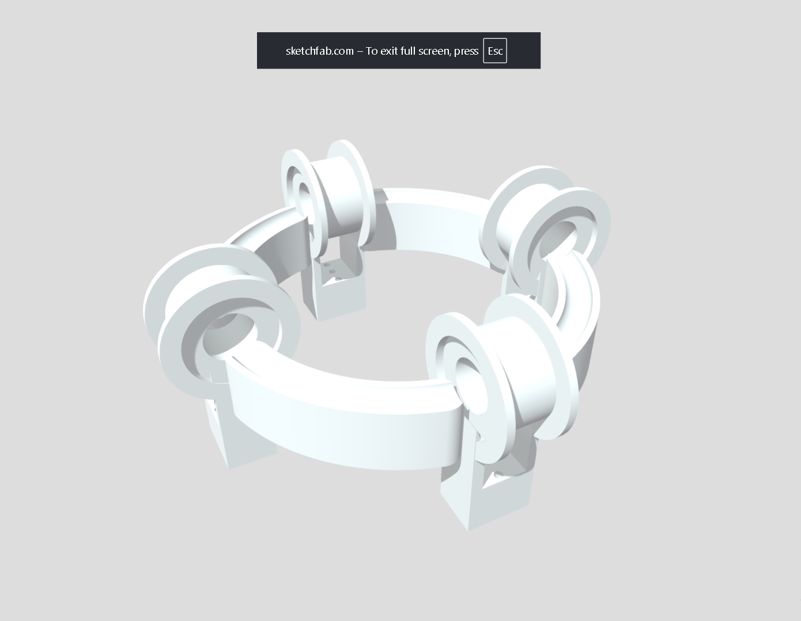
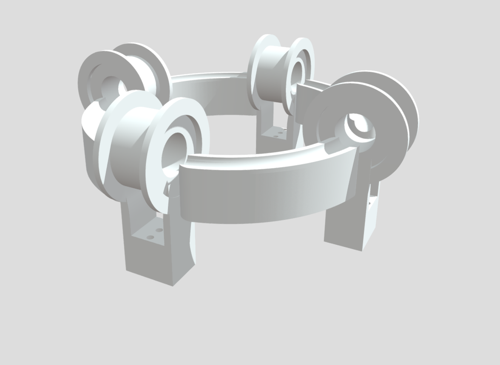
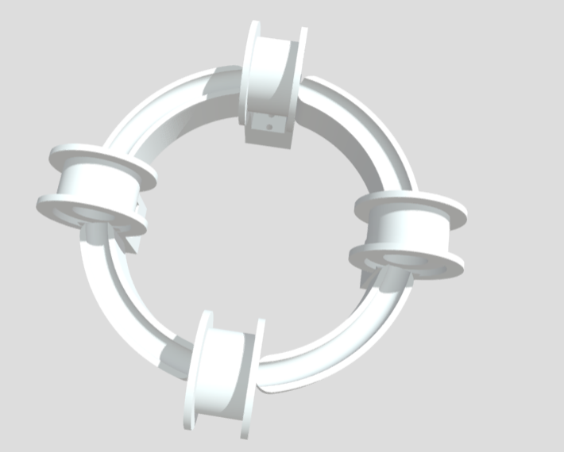

# Super Cooooilllll
A circular magnetic ball accelerator that takes in a metal ball in the tube going through the coil holes and then the ball acclerates really fast around the circular orbit acting like a mini particle accelerator

## What did I achieve from this project (in terms of learning):
- I learnt about electromagnetism in a depth
- I even studied maxwell's equations for fun
- I upgraded my CAD skills
- Most Important-> I had fun and got to know many other people while in the process of making this

# Demo Url :
https://sketchfab.com/3d-models/magnet-accelrometer-aa173e151e7f43308908b40d070605f5

### What Does it Do:
Four electromagnetic coils are spaced around a ring. A steel ball sits inside a clear tube that loops through all four coils. Each coil fires in sequence as the ball approaches, flinging it to the next coil so the ball orbits the ring continuously, with no motor and no moving arm.

Because the ball's momentum has to go somewhere, speeding it up or stopping it kicks back on the ring itself (Newton's third law) or G Force we can put it like that too. Hold the ring while the ball changes speed and you feel a twist  ungrounded haptic feedback generated purely by a ball in motion.

The Device runs three modes namely:-
1) free spin --> the ball spins freely around the orbit
2) Memory --> The ball darts to random quarters in a growing sequence; you memorise and replay the order.
3) Blind Guess --> The rail is covered. The ball spins, then parks in one quarter. You guess which  from the reaction force alone.

# How it works


The ring is split into four quarters (12/3/6/9 o'clock). At each quarter sits a coil and an IR position sensor.

The core firing loop is split into several parts:
1) once the ball approaches the coil the ir sensor detects it (to put it simply)
2) The sensor interrupts fire and the microcontroller turns **ON**
3) The coil starts pulling the ball towards the center
4) a timer(hardware timer) cuts the coil **Off** just as the ball reaches the center
5) thus the ball carries the speed it gained and launches towards the other side
6) and it repeats thus the endless rotation(till the battery runs out ofc lol!)


# How does our project matches the **Endless** theme:
The whole device is built so the ball orbits the ring continuously, with no start or end point (thus being endless in one sense). Four coils keep feeding it energy every lap, so unlike a normal *projectile* that slows and stops, this one is keeps moving in a loop right so it does not slow down for example like an arrow . So a ball that does not stop moving is "endless" in some sense

the loop of the ball going from 1st to 4th continues, the loop has no exit condition!

# Why couldnt we bring the project into life (unfortunately!):
We(me, yussaf and mohammad) all tried our best to replicate our design in real life but we faced many hurdles in our process of doing that first was once we encountered the long process to get hardware grant so that delayed our time to buy the parts and start building, second was definetely the time constraint and the multiple trips that we took to explore egypt tired some of us out and then there was the last one which is most of the parts arent availaible in the local shops in cairo, keeping that in mind I promise to make it in real life once I reach my home back in India.

# Repo Structure:
```
endless-orbit/
├── README.md
├── BOM.csv
├── image.png
├── CAD/
│   └── magnet accelrometer.stl
├── docs/
│   ├── system_diagram.svg
│   └── coil_driver.svg
└── render/
    ├── image-1.png
    ├── image-2.png
    └── image-3.png
```

# Render Images




Built at Horizons Equinox the Best Hackathon I have ever attended!